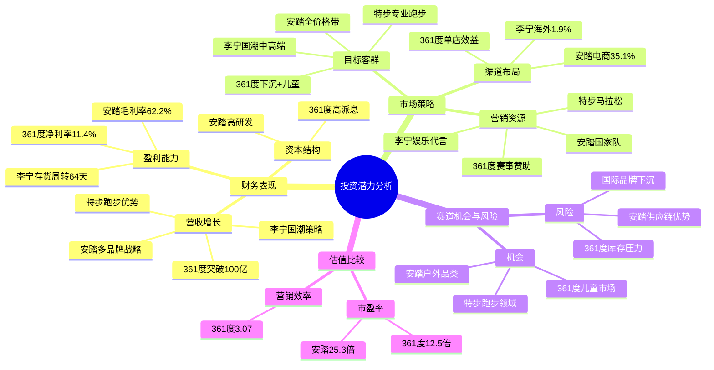

# 四家公司投资潜力分析报告的故事线梳理

## 1. 核心问题
分析361度、特步国际、安踏体育和李宁四家最近3年的财报，比较评估其投资潜力。

## 2. 逻辑框架
### 2.1 财务表现
- **营收增长**：361度2024年营收突破100亿，同比增长19.6%；安踏多品牌战略效果显著；李宁国潮策略持续性强；特步专业跑步领域优势明显。
- **盈利能力**：安踏毛利率62.2%领先行业；361度净利率11.4%稳健；李宁存货周转天数64天最优。
- **资本结构**：361度派息比例45.0%，负债率27.1%；安踏研发投入规模领先。

### 2.2 市场策略
- **目标客群**：361度聚焦下沉市场+儿童；安踏多品牌全价格带覆盖；李宁国潮中高端；特步专业跑步领域。
- **营销资源**：361度赛事赞助转化率高；特步马拉松赛事优势；安踏国家队赞助；李宁娱乐代言破圈。
- **渠道布局**：361度线下单店效益提升；安踏电商收入占比35.1%；李宁海外收入占比1.9%。

### 2.3 赛道机会与风险
- **赛道机会**：361度儿童市场增长空间大；特步专业跑步领域优势；安踏户外品类领先。
- **竞争风险**：国际品牌下沉未显著影响份额；361度库存周转天数107天需优化；安踏供应链全球化优势显著。

### 2.4 估值比较
- **市盈率**：安踏25.3倍最高，361度12.5倍最低。
- **营销效率**：361度投入产出比3.07最优。

## 3. 思维导图

## 4. 结论
- **361度**：估值低，营销效率高，但需优化库存管理。
- **特步**：专业跑步领域优势明显，增长稳健。
- **安踏**：多品牌战略和全球化供应链支撑高估值。
- **李宁**：国潮策略持续性强，渠道健康度最佳。